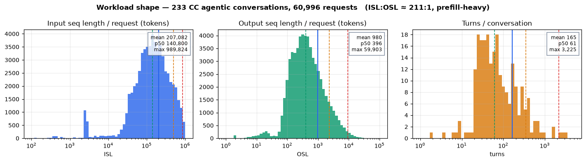
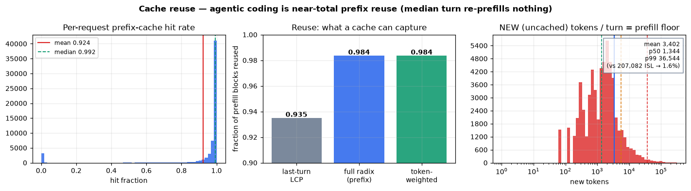
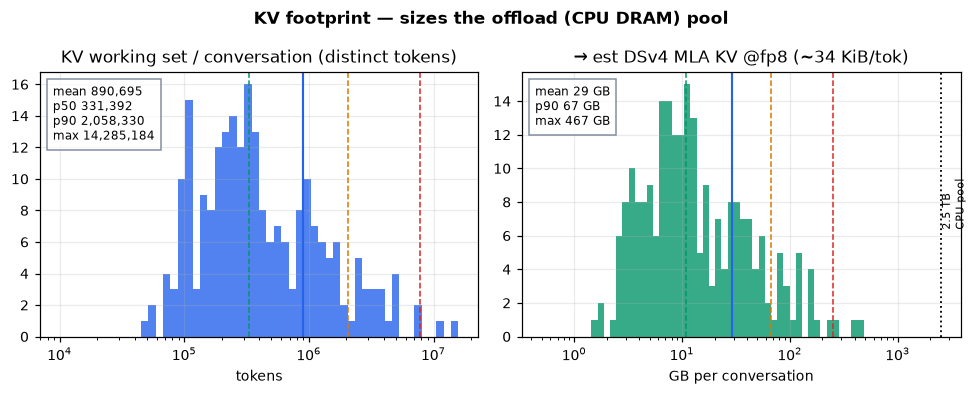
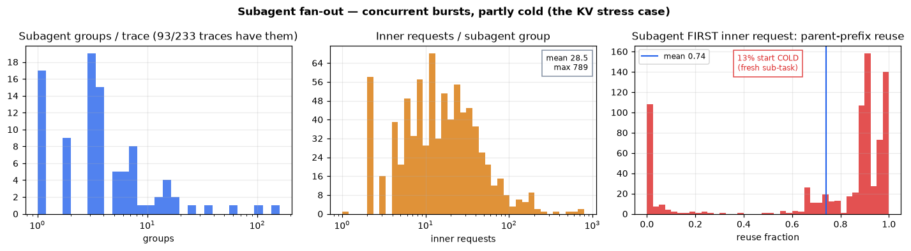
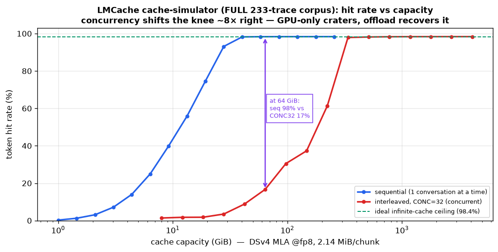
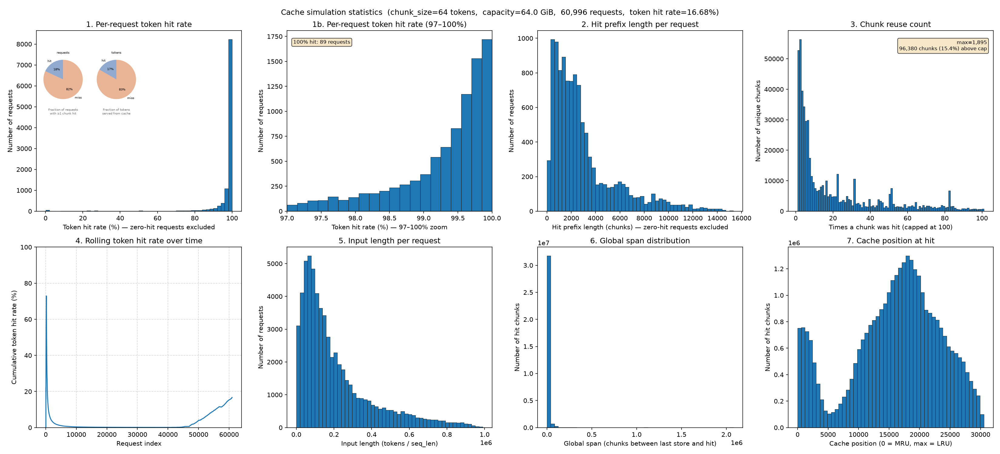

# Weka CC Agentic Trace — Data & Cache Analysis

**Corpus:** `semianalysisai/cc-traces-weka-061526` — the dataset DeepSeek-V4 replays on MI355X.
233 real Claude Code coding conversations, 60,996 model requests (38,529 main + 22,467 subagent-inner). All stats below are over **all requests** (matches corpus stats.txt).

## TL;DR
Prefill-heavy (ISL:OSL ≈ 211:1) and near-totally prefix-reusable: a perfect prefix cache serves **98.4%** of all prefill blocks. Block hashes are **prefix-chained** (same id ⟹ same prefix), so every hit is a true contiguous-prefix hit. The benchmark turns on **keeping each conversation's prefix resident** across long think-time gaps + subagent bursts — the job of KV offload (LMCache/HiCache). Per-conversation KV ~29 GB mean / ~67 GB p90 (est DSv4 MLA@fp8) → multi-TB CPU pool.

## 1. Workload shape

- ISL mean 207,082 (p50 140,800, max 989,824); OSL mean 980 (p50 396). Ratio ≈ 211:1.
- Turns/conversation: mean 165, p50 61, max 3,225.
- **Cost center is prefill, not decode.**

## 2. Cache reuse — near-total, all prefix

- Token-weighted reuse **0.9836**; median per-request hit 0.992 (mean 0.924).
- Perfect cache → only **1.6%** of input re-prefilled (mean 3,402 new tok/turn).
- Set-membership == contiguous-prefix reuse to 4 decimals → **all reuse is prefix reuse**.
- Last-turn-only captures 93.5%; full radix over the conversation captures 98.4%.
- Hashes **prefix-chained** (488k blocks, 1 predecessor each) → same id ⟹ same prefix; cross-conversation reuse = 0 (`scope=local`).

## 3. KV footprint — offload sizing

- Working set/conversation: mean 890,695 tok, p50 331,392, p90 2,058,330, max 14,285,184.
- Est DSv4 MLA @fp8 (~34 KiB/tok): mean ~29 GB, p90 ~67 GB, max ~467 GB / conversation.
- 2.5 TB CPU pool ≈ 86 mean (or ~37 p90) conversations resident.

## 4. Subagents — KV stress case

- 93/233 traces (40%) spawn subagents; mean 8.5 groups/trace (max 153), 29 inner reqs/group.
- Fan out **concurrently** (in-flight > CONC); **13% of groups start COLD** (fresh sub-task) → synchronized fresh ~112k prefills.

## 5. LMCache `tool cache-simulator` — realized hit rate vs capacity

The 98.4% reuse is an **infinite-cache** ceiling. LMCache's offline simulator (`lmcache tool cache-simulator`, lmcache-cli on CPU) replays the traces through a **finite LRU** (**full 233-conv corpus**, DSv4 MLA@fp8, 2.14 MiB/chunk):
- **Sequential** (1 conversation at a time): hits 98.4% ceiling only above **~40 GiB** (≈ a conversation's working set); below collapses (19 GiB→75%, 9 GiB→40%).
- **CONC=32** concurrent: knee shifts ~8× right (saturates **~340 GiB**). At a GPU-realistic **64 GiB the same workload drops 98%→17%**.

| capacity | sequential | CONC=32 |
|--|--:|--:|
| 9 GiB | 40% | ~2% |
| 28 GiB | 93% | 3.5% |
| 64 GiB | 98.3% | 16.7% |
| 147 GiB | 98.4% | 37% |
| 337 GiB | 98.4% | 98% |
| 512 GiB | 98.4% | 98.2% |

The gap = reuse a too-small GPU cache loses, recovered by CPU offload.

`simulate` also emits a 7-panel stats PNG (per-request hit dist, hit-prefix length, chunk reuse, rolling hit rate, input length, reuse-distance, LRU position at hit):

Stressed point CONC=32 @ 64 GiB (full corpus): **164M evictions**, 81.9% of requests get 0% hit, rolling hit rate ~0.1–0.8% most of the run then tail-recovers to 16.7%, hits land deep in LRU (p90 position 25k/30k) — the GPU cache thrashing that offload fixes.

## 6. Implications for DeepSeek-V4 + LMCache (MI355X)
- Prefill-bound, 98% prefix-reusable → perf = how much prefix stays resident.
- Reuse number is ideal-cache upper bound; under concurrency + think-time gaps idle prefixes evict → offload recovers them.
- Size LMCache L1 / `--kv-offloading-size` for the **tail** (~67 GB p90), not the mean.
- Size `--max-num-seqs` + KV headroom for the **subagent spike**; widest none-vs-lmcache gap on the 40% subagent traces.
- `scope=local` → no cross-lane sharing; each lane needs its own resident prefix.

---
*Method: single pass over traces.jsonl. All stats over all 60,996 requests (main + subagent-inner), matching corpus stats.txt (ISL mean 207,082). Hit = fraction of a request's blocks already seen in its conversation (block_size 64). Turns/conversation = main-agent turns only. KV est = (512+64)×61×1B(fp8) ≈ 34 KiB/tok — adjust to DSv4 real dims. Reproduce: `analyze_weka_cache.py`, `make_figs.py`.*
